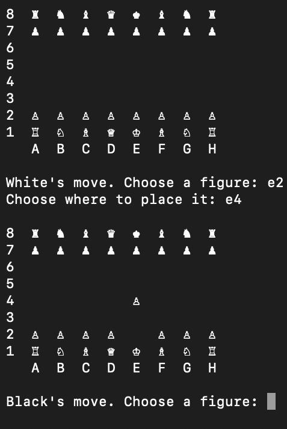
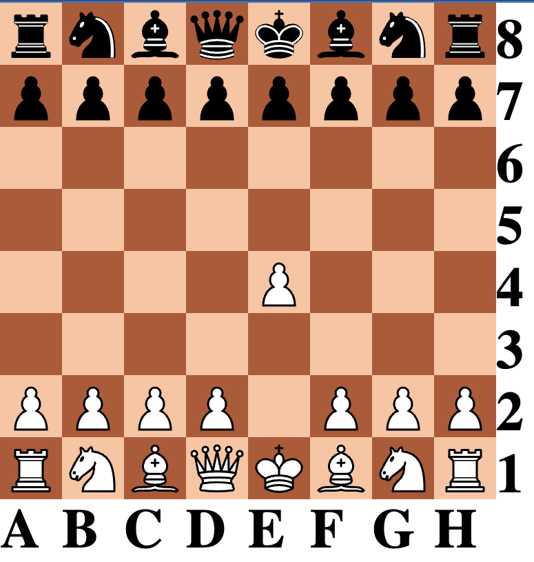

# Chess-game

###Requirments
```Python version 3.12``` and chevron are rquired to run the project


```pip install chevron```

##How to play
Start ```main.py``` file:

```python3 main.py```

and simply enter your move in such format:


This programm also renders chessboard in svg format(new_board.svg), but after each move you need to update browser page.


"En passant" and "castling" are not avaliable
